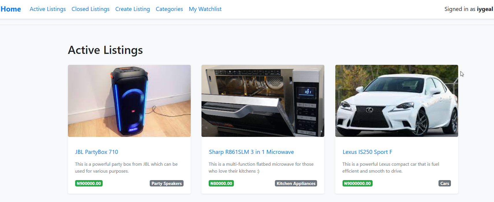
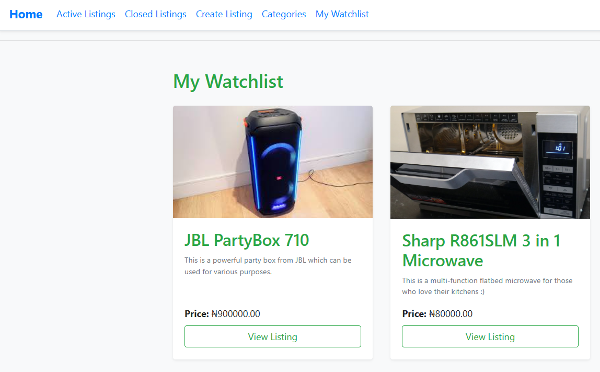
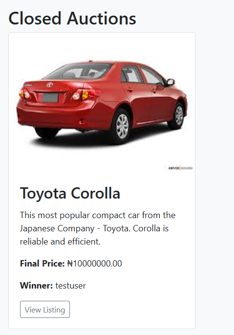
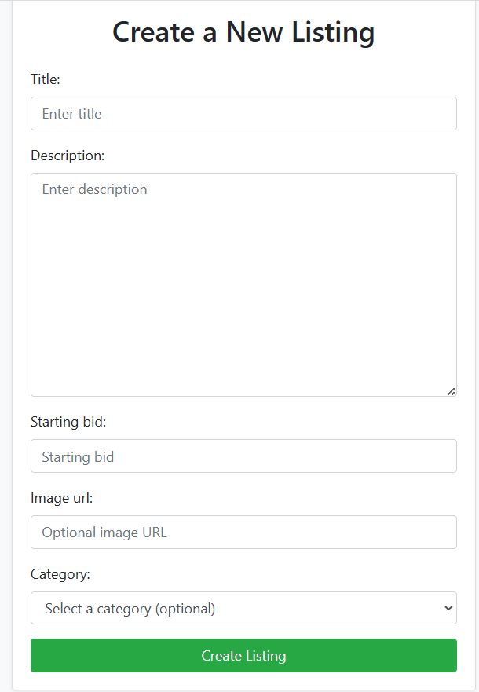

# E-Commerce Auctions

A full-stack auction web application built with Django that allows users to create listings, place bids, manage watchlists, and browse items by category. This project was originally inspired by the CS50 Commerce project but has been enhanced with improved UI styling, better user experience, and production-style deployment practices.

---

## Screenshots
### Active Listings/Homepage


### Watchlist



### Closed Auctions


### Create New Listing



## ✨ Features

### 👤 Authentication

* User registration and login
* Secure logout
* Personalized experience for authenticated users

### 🛍 Listings

* Create auction listings
* Upload product images via external image URLs
* Set starting bid prices
* Add descriptions and categories

### 💰 Bidding System

* Users can place bids on active listings
* Bid validation ensures only higher bids are accepted

### ⭐ Watchlist

* Add listings to personal watchlist
* Remove listings anytime
* Dedicated watchlist page

### 🗂 Categories

* Browse listings by category
* Filter listings dynamically

### 🔒 Auction Closing

* Listing owners can close auctions
* Highest bidder is recorded as winner

### 🎨 UI / UX Improvements

* Bootstrap-based responsive layout
* Centered and optimized forms
* Styled navbar and alert banners
* Clean card-based listing display

---

## 🧰 Tech Stack

**Backend**

* Python
* Django
* SQLite (default for local development)

**Frontend**

* HTML
* CSS
* Bootstrap 4
* Django Templates

**Other Tools**

* widget_tweaks (for form styling)

---

## 📂 Project Structure

```
commerce/
│
├── auctions/           # Main Django app
├── commerce/           # Project settings
├── manage.py
└── db.sqlite3
```

---

## 🚀 Running Locally

### 1️⃣ Clone the Repository

```
git clone https://github.com/iygeal/e-commerce-auctions.git
cd e-commerce-auctions
```

### 2️⃣ Create Virtual Environment

**Windows:**

```
python -m venv venv
venv\Scripts\activate
```

**Mac/Linux:**

```
python3 -m venv venv
source venv/bin/activate
```

### 3️⃣ Install Dependencies

```
pip install -r requirements.txt
```

If requirements.txt is missing, install manually:

```
pip install django
pip install django-widget-tweaks
```

### 4️⃣ Apply Migrations

```
python manage.py migrate
```

### 5️⃣ Create Superuser (Optional)

```
python manage.py createsuperuser
```

### 6️⃣ Run Development Server

```
python manage.py runserver
```

Then open:

```
http://127.0.0.1:8000/
```

---

## 🖼 Image Handling

Images are loaded using external image URLs.

Recommended image hosting services:

* PostImages
* Imgur (direct image links only)

Example working format:

```
https://i.postimg.cc/xxxx/image.jpg
```

---

## 🧪 Demo Data Reset

To reset database data while keeping schema:

```
python manage.py flush
```

---

## 📌 Future Improvements

* Cloud image uploads (Cloudinary or AWS S3)
* Payment integration
* Real-time bidding updates
* REST API support
* Docker containerization

---

## 👨‍💻 Author

Built as part of a full-stack learning journey and portfolio development.

---

## 📜 License

This project is for educational purposes.

---

## 🙌 Acknowledgements

* CS50 Web Programming with Python and JavaScript
* Django Documentation
* Bootstrap Documentation
